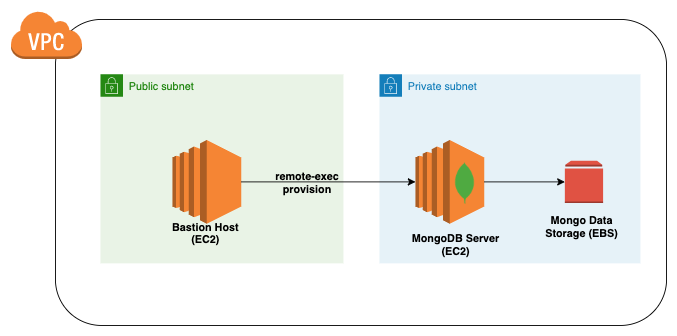

# Terraform module to provision MongoDB using AWS-EC2

This module is part of a project to simplify the provisioning of MongoDB on AWS cloud using Terraform. 
You may also wish to consider [one of the other approaches](https://github.com/everest-engineering/terraform-mongodb-provisioning).

# Terraform MongoDB provisioner using AWS EC2

This module provision MongoDB server on AWS EC2 instance using Ansible provisioner.



This module uses [undergreen.mongodb](https://galaxy.ansible.com/undergreen/mongodb) Ansible role to provision mongodb.
So, you can use any of the [platforms supported by **undergreen.mongodb**](https://github.com/UnderGreen/ansible-role-mongodb/blob/master/README.md) role while selecting the AMI ID.

### Pros
1. Simplified MongoDB provisioner supporting Replication
2. EC2 instances can be provisioned with newer MongoDB versions and attach to existing EBS data volumes if versions are compatible.
3. MongoDB can be provisioned in either public subnet or in private subnet using Bastion host.

### Cons
1. Dynamic increase/decrease of number of replica nodes is not yet supported.
2. No out-of-the-box monitoring support.

## Dependencies

### 1. Ansible provisioner
This module depends on the Ansible provisioner. 
See the [installation instructions](https://github.com/radekg/terraform-provisioner-ansible#installation).

Download a [Prebuilt release available on GitHub](https://github.com/radekg/terraform-provisioner-ansible/releases),
rename it to **terraform-provisioner-ansible** and place it in **~/.terraform.d/plugins** directory.

### 2. Install Ansible role undergreen.mongodb

`> ansible-galaxy install undergreen.mongodb --ignore-errors --ignore-certs`

### 3. SSH Keys
User needs to provide SSH keys for this module to perform remote provisioning.

You can generate SSH keys using the following command:

`$ ssh-keygen -t rsa -b 4096 -C "your_email@example.com"`

For more info on generating SSH keys refer https://help.github.com/en/github/authenticating-to-github/generating-a-new-ssh-key-and-adding-it-to-the-ssh-agent

## Prerequisite

The data should be persistent across the EC2 restarts/termination. 
So a better approach would be to store MongoDB data on externally created EBS volume and attach/mount to EC2 instance.

> Note: To attach EBS volume to an EC2 instance they both need to be in same availability_zone.

## How to use this module?
We can use this module to provision MongoDB server either in public subnet or in a private subnet.

### 1. Provision MongoDB in Public Subnet

If we want to provision MongoDB in a public subnet then MongoDB server can be provisioned using SSH directly
without requiring bastion host as follows: 

```hcl-terraform
module "mongodb" {
  source            = "path/to/module"
  vpc_id            = var.vpc_id
  subnet_id         = var.subnet_id
  ssh_user          = "ubuntu"
  instance_type     = "t2.micro"
  ami_filter_name   = "ubuntu/images/hvm-ssd/ubuntu-bionic-18.04-amd64-server-*"
  ami_owners        = ["099720109477"]
  data_volumes      = var.data_volumes
  mongodb_version   = "4.2"
  replicaset_name   = "mongo-rp0"
  replica_count     = 1
  private_key       = file("~/.ssh/id_rsa")
  public_key        = file("~/.ssh/id_rsa.pub")
  tags = {
      Name        = "MongoDB Server"
      Environment = "terraform-mong-testing"
  }
}

variable "data_volumes" {
  type = list(object({
    ebs_volume_id = string
    availability_zone = string
  }))
  description = "List of EBS volumes"
  default = []
}

output "mongo_server_public_ip" {
  value = module.mongodb.mongo_server_public_ip
}
output "mongo_server_private_ip" {
  value = module.mongodb.mongo_server_private_ip
}
```

For more details see Example 1 - [mongodb-in-public-subnet](examples/mongodb-in-public-subnet)

### 2. Provision MongoDB in Private Subnet
If we want to provision MongoDB in a private subnet then a Bastion host(a.k.a Jump host) 
is required to provision MongoDB using SSH.

```hcl-terraform
module "mongodb" {
  source            = "path/to/module"
  vpc_id            = data.aws_vpc.default.id
  subnet_id         = data.aws_subnet.subnet.id
  ssh_user          = "ubuntu"
  instance_type     = "t2.micro"
  ami_filter_name   = "ubuntu/images/hvm-ssd/ubuntu-bionic-18.04-amd64-server-*"
  ami_owners        = ["099720109477"]
  data_volumes      = var.data_volumes
  mongodb_version   = "4.2"
  replicaset_name   = "mongo-rp0"
  replica_count     = 1
  private_key       = file("~/.ssh/id_rsa")
  public_key        = file("~/.ssh/id_rsa.pub")
  bastion_host      = "BASTION_HOST_IP_HERE"
  tags = {
        Name        = "MongoDB Server"
        Environment = "terraform-mong-testing"
  }
}
```

For more details see Example 2 - [mongodb-in-private-subnet](examples/mongodb-in-private-subnet)

### Inputs
| Name              | Description                               | Type  | Default | Required | 
| ----------------- | :--------------------------------         | ------| -------| ---------|
| vpc_id	        | The VPC ID to launch in                   | 	string | n/a  | yes
| subnet_id	        | The VPC Subnet ID to launch in            | 	string | n/a  | yes
| data_volumes      | The EBS volume ids and their respective availability zones. | `list(object({ ebs_volume_id, availability_zone}))`	 | n/a | 	yes
| private_key       | Path to private key file                  |   string | n/a | yes
| public_key        | Path to public key file                   |   string | n/a | yes
| ssh_user          | SSH user name                             |   string | n/a | yes
| bastion_host      | Bastion host Public IP                    |   string | n/a | yes
| instance_type	    | The type of instance to start             | 	string | "t2.micro"	 | no
| ami	            | ID of AMI to use for the instance         | 	string | ""	 | no
| ami_filter_name   | AMI selection filter by name. This will be ignored if `ami` value is specified | 	string | "ubuntu/images/hvm-ssd/ubuntu-bionic-18.04-amd64-server-*" | 	no
| ami_owners        | AMI owners filter criteria                | 	list(string) | `["self", "amazon", "aws-marketplace"]` | 	no
| mongodb_version   | MongoDB version to install                | 	string | "4.2" | 	no
| replicaset_name   | MongoDB replicaset name                   | 	string | "" | 	no
| replica_count     | Number of Replica nodes                   | 	number | 0  | 	no
| tags              | Tag for EC2                               |   map(string) | {} | no

### Outputs

| Name | Description | 
| ------ | ----------| 
| mongo_server_public_ip    | Public IP of provisioned MongoDB server | 
| mongo_server_private_ip   | Private IP of provisioned MongoDB server | 


## Testing

1. Install Go https://golang.org/doc/install
2. Configure AWS Credentials as environment variables as mentioned above.

```shell script
> cd test
> go test -v
```
## Contributing
We appreciate your help!
 
[Open an issue](https://github.com/everest-engineering/terraform-mongodb-provisioning-ec2/issues/new/choose) or submit a pull request for an enhancement. 
Browse through the 
[current open issues](https://github.com/everest-engineering/terraform-mongodb-provisioning-ec2/issues).

## License
[Apache License 2.0](LICENSE)

## Authors
>Talk to us `hi@everest.engineering`.

[](https://everest.engineering)